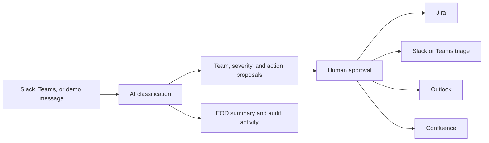

# OpsPilot

OpsPilot is an AI-assisted operations dashboard that converts workplace conversations into governed actions. It monitors approved Slack or Microsoft Teams sources, classifies incidents and tasks, routes them to the correct team, and proposes Jira tickets, triage alerts, Outlook emails, Confluence pages, and employee end-of-day summaries. External actions remain behind human approval by default.

**Live demo:** [opspilot-pqgk.onrender.com](https://opspilot-pqgk.onrender.com)

## What it does

- Reads messages from configured Slack channels or enterprise Microsoft Teams channels.
- Uses a configurable GPT-5.6 model to identify actionable work, severity, ownership, and required workflows.
- Creates reviewable proposals for Jira, Slack/Teams triage, Outlook, and Confluence.
- Generates meeting-note and resolved-incident drafts before publishing them to Confluence.
- Produces employee EOD summaries, with manual delivery and a timezone-aware 5 PM scheduler.
- Provides Microsoft OAuth login, approver roles, consent controls, audit activity, retries, and duplicate prevention.
- Exposes Prometheus metrics and structured, redacted logs for the included Grafana/Loki monitoring stack.

## How it works



The browser UI is served by a dependency-free Node.js HTTP service. Connectors live under `src/connectors/`, workflow orchestration is in `src/workflow.js`, AI classification and drafting are in `src/agent.js`, and the pilot state store is in `src/store.js`.

## Quick start with sample data

### Requirements

- Node.js 20 or newer
- No third-party runtime packages are required

### Start in demo mode

```bash
git clone https://github.com/nimit708/OpsPilot.git
cd OpsPilot
cp .env.example .env
node --env-file=.env src/server.js
```

Keep these values for a credential-free local run:

```dotenv
APP_MODE=demo
HOST=127.0.0.1
PORT=3080
TLS_CERT_PATH=
TLS_KEY_PATH=
EXTERNAL_HTTPS=false
MS_OAUTH_CLIENT_ID=
MS_OAUTH_CLIENT_SECRET=
MS_OAUTH_REDIRECT_URI=http://127.0.0.1:3080/auth/callback
SECURE_COOKIES=false
```

Open [http://127.0.0.1:3080](http://127.0.0.1:3080), then select **Try demo incident**. You can also call the demo endpoint directly:

```bash
curl -X POST http://127.0.0.1:3080/api/demo/intake \
  -H 'Content-Type: application/json'
```

The sample represents this Slack-style incident:

```text
Checkout is failing with 500 errors for all customers. Please investigate urgently,
notify stakeholders, and create a Confluence incident page.
```

In demo mode, OpsPilot produces safe simulated proposals for Jira, triage, Outlook, and Confluence. It does not contact external services or require real credentials.

## Configure live integrations

Copy `.env.example` to `.env` and provide only the integrations you intend to test. Never commit `.env`, API tokens, OAuth secrets, certificates, or `data/state.json`.

The main configuration groups are:

- `OPENAI_*` for classification and knowledge drafting.
- `MS_OAUTH_*` for dashboard login and delegated Outlook email.
- `SLACK_*` for channel intake, triage posts, and signed webhook events.
- `JIRA_*` and `ROUTE_*_JIRA` for team-specific ticket routing.
- `CONFLUENCE_*` for approved page publication.
- `MS_TENANT_ID`, `MS_CLIENT_ID`, and related Teams values for enterprise Graph access.
- `ADMIN_EMAILS` and `APPROVER_EMAILS` for role-based authorization.
- `SCHEDULER_*`, `EOD_HOUR`, and `EOD_TIME_ZONE` for automated intake and EOD delivery.

Set `APP_MODE=production` only after completing the required credentials. The service validates critical production configuration and refuses to start if required values are incomplete.

### Local HTTPS

For a Microsoft redirect registered as `https://localhost:3080/auth/callback`, create a trusted localhost certificate. On macOS, the easiest development option is `mkcert`:

```bash
brew install mkcert
mkcert -install
mkdir -p certs
mkcert -cert-file certs/localhost.pem -key-file certs/localhost-key.pem localhost 127.0.0.1 ::1
```

Configure `.env`:

```dotenv
HOST=127.0.0.1
TLS_CERT_PATH=certs/localhost.pem
TLS_KEY_PATH=certs/localhost-key.pem
MS_OAUTH_REDIRECT_URI=https://localhost:3080/auth/callback
SECURE_COOKIES=true
```

Then open `https://localhost:3080`. OpsPilot uses HTTPS whenever both TLS paths are configured and rejects incomplete TLS settings. The Microsoft redirect URI must match exactly. Certificate and key files under `certs/` are ignored by git. A plain self-signed OpenSSL certificate can test the server but causes a browser warning unless manually trusted; `mkcert` avoids that for local development.

## Production integrations

- **Jira Cloud REST v3:** creates issues through `/rest/api/3/issue`, uses Atlassian Document Format descriptions, labels every issue, and stores the OpsPilot action ID as an issue property.
- **Slack Web API:** polls configured channel IDs with `conversations.history`, posts incident threads using `chat.postMessage`, and supports signed Events API callbacks at `POST /webhooks/slack`.
- **Microsoft Graph / Teams:** reads configured channel messages using application credentials.
- **Microsoft Graph / Outlook:** sends action notifications and EOD summaries as the configured `OUTLOOK_SENDER`.
- **Teams triage:** supported through a Teams Workflow webhook. Set `TRIAGE_PROVIDER=teams` to send only to Teams or `both` to post to Slack and Teams.
- **Confluence Cloud REST v2:** creates approved meeting-note and incident-review pages in a configured space. Drafts are generated locally in OpsPilot and are never published without approval.

## Microsoft login

Register a Microsoft identity-platform **Web** application and choose the supported account type **Accounts in any organizational directory and personal Microsoft accounts**. Add the exact redirect URI from `MS_OAUTH_REDIRECT_URI`, create a client secret, and grant delegated `User.Read` and `Mail.Send`. OpsPilot also requests standard `openid`, `profile`, `email`, and `offline_access` scopes.

The login uses authorization code flow with PKCE and the `/common` authority. Microsoft tokens remain server-side; the browser receives an opaque `HttpOnly`, `SameSite=Lax` session cookie. Set `SECURE_COOKIES=true` behind production HTTPS. Personal Microsoft accounts can sign in and send Outlook mail, but do not gain organizational Teams channel/transcript access.

For a personal-account demo, create a Teams Workflow using the **When a Teams webhook request is received** trigger, copy its URL into `TEAMS_TRIAGE_WEBHOOK_URL`, and set `TRIAGE_PROVIDER=teams` or `both`. This demonstrates outbound incident/triage creation in Teams. Reading organization channel messages or automatically retrieving meeting transcripts still requires a Microsoft 365 work/school tenant, Graph permissions, and administrator consent. Sample meeting text can be submitted to `POST /api/meetings/draft` for the approval workflow.

## Public demo URL

The included `render.yaml` and `Dockerfile` can deploy the dashboard as a Render web service. Render terminates public HTTPS, so hosted configuration must use `HOST=0.0.0.0`, `EXTERNAL_HTTPS=true`, empty `TLS_CERT_PATH`/`TLS_KEY_PATH`, and an OAuth redirect such as `https://YOUR-SERVICE.onrender.com/auth/callback`. Add that exact redirect URI to the Microsoft app registration and configure secrets in Render's environment settings; never upload `.env`.

The current JSON state store and login sessions are local to one running container. They can reset when a free service restarts or spins down, so this setup is appropriate for a working demo, not durable production. PostgreSQL-backed state and sessions are the next step before a multi-instance or always-on launch.

In demo mode, a signed-in user receives the approver role. In production, users default to employee; list explicit approvers/admins in `APPROVER_EMAILS` or `ADMIN_EMAILS`. Completed actions record the approving identity.

Use a dedicated Microsoft Entra application. Grant the least privileges your tenant workflow needs (typically application permissions for reading the selected Teams messages, basic user lookup, and `Mail.Send`), then obtain admin consent. Restrict access further with Microsoft application access policies where available. The Slack bot needs `chat:write`, `users:read`, `users:read.email`, and only the history scopes for channel types it monitors; invite it only to approved channels. The Jira service account needs Browse Projects and Create Issues only in routed projects.

The Confluence service account needs access to the configured space and permission to create pages. Configure a Jira/incident-management completion webhook to `POST /webhooks/incidents` with `X-OpsPilot-Secret`. Resolved, closed, done, or completed events create a pending incident-review draft. Meeting systems can submit `{ title, transcript, meetingId, team }` to authenticated `POST /api/meetings/draft`. Microsoft Graph transcript retrieval requires `OnlineMeetingTranscript.Read.All` (or applicable resource-specific consent) plus an application access policy; only meetings with recording/transcription and tenant access enabled produce transcripts.

## Security and operational behavior

- Production `/api/*` endpoints require a valid Microsoft session or `Authorization: Bearer <ADMIN_API_TOKEN>`.
- Confluence drafts can be previewed and edited in the approval queue. Approval publishes through `/wiki/api/v2/pages` and records the page link.
- Slack webhook payloads require a valid HMAC signature and a timestamp no older than five minutes.
- External actions default to human approval. A workflow action is atomically claimed before execution, preventing double-click duplicates.
- Failed external actions are retained as `failed` and can be explicitly retried.
- Requests have timeouts, bounded retries, `Retry-After` handling, response-size limits, and browser security headers.
- Health endpoints: `GET /healthz` checks the process; `GET /readyz` verifies configured external services.
- Source IDs prevent repeated message intake. Jira action IDs and Slack metadata provide external audit correlation.
- Secrets are read only from environment variables and excluded from git.

## Privacy and worker monitoring

Production mode requires a documented `MONITORING_LAWFUL_BASIS`, versioned notice, and explicit approver/admin identities. Employees receive a transparency/acknowledgement screen before dashboard access. When `REQUIRE_EMPLOYEE_CONSENT=true`, messages from unacknowledged identities are skipped without logging their content. Users can withdraw, submit access/correction/deletion/objection/restriction requests, and export their own OpsPilot data through the privacy API.

Retention defaults to 30 days. Structured logs redact tokens, secrets, bodies, transcripts and messages. Templates are provided in `docs/EMPLOYEE_MONITORING_POLICY.md`, `docs/DPIA_TEMPLATE.md`, and `docs/RETENTION_AND_DATA_MAP.md`. These controls and templates are not legal advice; privacy/legal owners must approve the lawful basis, DPIA, notice, retention, transfers, consultation and excluded sources before rollout.

## Grafana OSS monitoring

`docker-compose.monitoring.yml` runs OpsPilot, Prometheus, Loki, Grafana Alloy and Grafana OSS. Prometheus scrapes `/metrics`; Alloy sends structured container logs to Loki; Grafana provisions both data sources and an OpsPilot dashboard.

```bash
docker compose -f docker-compose.monitoring.yml up -d
```

Open OpsPilot at `http://127.0.0.1:3080` and Grafana at `http://127.0.0.1:3000`. Set a strong `GRAFANA_ADMIN_PASSWORD`. This stack is for a local/private network: Loki has no built-in authentication, so do not publicly expose ports 3000, 9090 or 3100. Pin image digests and add TLS/authentication before production.

The JSON file store is safe for a single-process pilot. Before horizontal scaling, replace `src/store.js` with PostgreSQL and enforce unique constraints on `messageId` and action idempotency keys. Use a queue such as SQS, Service Bus, or BullMQ for external actions. Run the built-in scheduler on only one replica, or invoke the intake/EOD endpoints through your platform scheduler.

For the single-instance demo deployment, `SCHEDULER_ENABLED=true` with `POLL_INTERVAL_MS=120000` polls configured message sources every two minutes. Manual and scheduled scans share a single-flight guard, so they cannot overlap. For production-grade incident latency, configure the signed Slack Events endpoint at `POST /webhooks/slack`; polling should remain a fallback because hosted services can sleep or restart.

## EOD summaries and privacy

`GET /api/digests` previews summaries; approvers can use **Send EOD summaries** or `POST /api/digests/send` to send them through their delegated Outlook session. With `SCHEDULER_ENABLED=true`, `EOD_HOUR=17`, and `EOD_TIME_ZONE=Europe/London`, the single-instance scheduler attempts delivery once each day at 5:00 PM and records the delivered date to prevent duplicates. Personal Microsoft accounts require an active signed-in approver session; a restart or expired session prevents unattended delivery, so organizational app-only mail or durable encrypted delegated-token storage is required for reliable production scheduling. Employees should opt in, know which channels are monitored, and be able to correct summaries. Establish retention, legal basis, access controls, regional storage, and exclusions for private/HR/security conversations before production rollout. EOD reporting should summarize declared work—not infer productivity or performance.

## Dashboard demo intake

Authenticated users can select **Try demo incident** to submit a synthetic Slack payment outage through the real classification and approval pipeline without accessing their Slack workspace. The endpoint creates pending proposals only; Jira, Slack, Outlook, and Confluence writes still require an authorized approver. Each signed-in identity is limited to one demo run every two minutes to control API usage.

## Project structure

```text
public/                       Dashboard, login, consent, and policy UI
src/server.js                 HTTP routes, webhooks, security headers, and static files
src/agent.js                  GPT-5.6 classification and Confluence drafting
src/workflow.js               Intake, approvals, retries, EOD summaries, and orchestration
src/connectors/               Jira, Slack, Microsoft Graph, and Confluence clients
src/auth.js                   Microsoft OAuth, PKCE, roles, and delegated tokens
src/privacy.js                Consent, privacy requests, exports, and retention
src/scheduler.js              Two-minute intake and timezone-aware EOD delivery
src/monitoring.js             Metrics and redacted structured logging
monitoring/                   Grafana, Prometheus, Loki, and Alloy configuration
docs/                         Monitoring policy, DPIA, and retention templates
test/                         Unit, integration, navigation, scheduler, and E2E tests
render.yaml                   Render deployment blueprint
```

## How Codex and GPT-5.6 were used

OpsPilot was designed and implemented collaboratively in the Codex app using GPT-5.6 Sol. I supplied the product idea, workflow requirements, integration accounts, routing choices, privacy expectations, and feedback from live tests. Codex helped translate those decisions into implementation and supported the project throughout the following stages:

1. **Application foundation:** created the dependency-free Node.js backend, dashboard UI, state model, classification flow, approval queue, and connector boundaries.
2. **Agent behavior:** developed the structured GPT-5.6 prompt and JSON schema used to classify messages by actionability, team, severity, confidence, and proposed actions. GPT-5.6 also drafts factual meeting notes and incident-review pages while marking missing information for confirmation.
3. **Integrations:** implemented Jira Cloud, Slack, Microsoft Graph/Outlook, Teams, and Confluence request flows, including routing, idempotency metadata, retries, and health checks.
4. **Authentication and HTTPS:** added Microsoft Entra OAuth with authorization-code flow, PKCE, delegated Outlook permission, secure cookies, local certificates, and hosted callback handling.
5. **Privacy and safety:** added consent acknowledgement, retention controls, data-rights requests, role-based approvals, redacted logs, and human review before external writes.
6. **Debugging and deployment:** diagnosed Slack channel membership, consent filtering, raw Responses API parsing, hosted HTTPS, Render environment variables, Docker permissions, and OAuth redirect mismatches.
7. **Quality assurance:** created mocked integration tests and end-to-end scenarios for successful workflows, non-actionable messages, team routing, duplicate intake, connector failure and retry, EOD scheduling, and Confluence publication.

GPT-5.6 Sol was the development and reasoning model used through Codex. The model used by the running OpsPilot agent is independently configurable with `OPENAI_MODEL`; the repository default is `gpt-5.6-terra`, allowing deployments to balance capability and operating cost without changing the application code.

The resulting code and behavior were reviewed through local tests and live integration checks. Credentials, account creation, Microsoft/Slack/Atlassian configuration, deployment decisions, and final product validation remained human-controlled.

## Test

```bash
npm test
npm run test:e2e
```

Tests validate classifier routing, Jira request shape, Slack reads/writes, Microsoft token/Teams/Outlook flows, retry behavior, intake deduplication, and action execution without contacting live services.

The mocked end-to-end suite covers a Slack payment incident across Jira, triage, Outlook, and Confluence; Jira-only identity routing; non-actionable conversation suppression; duplicate Slack delivery protection; failed-email retention and retry; and resolved-incident publication to Confluence. It never uses credentials from `.env` or contacts external services, so it is safe for local runs and CI.

At the time of submission, the full suite contains 22 passing tests. Run `npm test` before relying on that count, as it will grow with the project.
